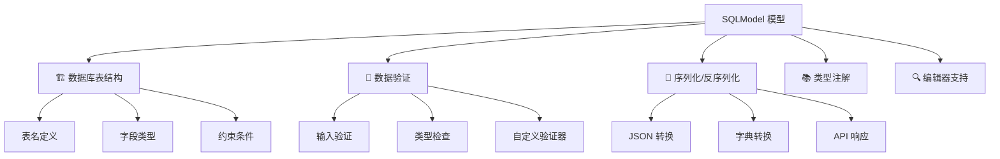

# 第一个 SQLModel 模型

## 📖 章节概览

本章将深入探讨 SQLModel 模型的定义和使用。我们将从最简单的模型开始，逐步学习字段类型、约束条件、表配置、数据验证等核心概念，并通过实际示例掌握模型设计的最佳实践。

## 🎯 学习目标

完成本章学习后，您将能够：
- ✅ 理解 SQLModel 模型的基本结构和工作原理
- ✅ 掌握各种字段类型和约束条件的使用
- ✅ 配置表名、索引和其他数据库特性
- ✅ 实现数据验证和自定义验证器
- ✅ 使用模型继承和组合设计复杂数据结构
- ✅ 处理模型之间的关系（预览）
- ✅ 应用模型设计的最佳实践

---

## 1. SQLModel 模型基础

### 1.1 什么是 SQLModel 模型？

SQLModel 模型是一个 Python 类，它同时具备以下特性：



### 1.2 基本模型结构

```python
# basic_model.py
from typing import Optional
from sqlmodel import SQLModel, Field
from datetime import datetime

class Hero(SQLModel, table=True):
    """英雄模型 - 最基本的 SQLModel 示例"""
    
    # 主键字段
    id: Optional[int] = Field(default=None, primary_key=True)
    
    # 必填字段
    name: str = Field(max_length=100, description="英雄名称")
    
    # 可选字段
    age: Optional[int] = Field(default=None, ge=0, le=200, description="年龄")
    
    # 带默认值的字段
    is_active: bool = Field(default=True, description="是否活跃")
    
    # 自动时间戳
    created_at: datetime = Field(default_factory=datetime.utcnow)
    
    # 类配置
    class Config:
        # 允许从 ORM 对象创建
        from_attributes = True
        # JSON 编码器配置
        json_encoders = {
            datetime: lambda v: v.isoformat()
        }
```

### 1.3 模型的三个层次

SQLModel 推荐使用三层模型设计：

```python
# three_layer_model.py
from typing import Optional
from sqlmodel import SQLModel, Field
from datetime import datetime

# 1. 基础模型（共享字段）
class HeroBase(SQLModel):
    """英雄基础模型 - 定义共享字段"""
    name: str = Field(max_length=100, description="英雄名称")
    secret_name: str = Field(max_length=100, description="真实姓名")
    age: Optional[int] = Field(default=None, ge=0, le=200, description="年龄")
    power_level: int = Field(ge=1, le=100, description="能力等级")

# 2. 数据库模型（表定义）
class Hero(HeroBase, table=True):
    """英雄数据库模型 - 对应数据库表"""
    id: Optional[int] = Field(default=None, primary_key=True)
    created_at: datetime = Field(default_factory=datetime.utcnow)
    updated_at: Optional[datetime] = Field(default=None)
    
    # 表配置
    __tablename__ = "heroes"  # 自定义表名

# 3. API 模型（输入/输出）
class HeroCreate(HeroBase):
    """创建英雄的请求模型"""
    pass  # 继承所有基础字段

class HeroRead(HeroBase):
    """读取英雄的响应模型"""
    id: int
    created_at: datetime
    updated_at: Optional[datetime] = None

class HeroUpdate(SQLModel):
    """更新英雄的请求模型"""
    name: Optional[str] = Field(default=None, max_length=100)
    secret_name: Optional[str] = Field(default=None, max_length=100)
    age: Optional[int] = Field(default=None, ge=0, le=200)
    power_level: Optional[int] = Field(default=None, ge=1, le=100)
```

**设计优势**：
- 🔄 **代码复用**：基础字段只定义一次
- 🛡️ **类型安全**：不同场景使用不同模型
- 📝 **清晰分离**：数据库、API、业务逻辑分离
- 🔧 **易于维护**：修改字段只需更新基础模型

---

## 2. 字段类型详解

### 2.1 基础数据类型

```python
# field_types.py
from typing import Optional, List, Dict, Any
from sqlmodel import SQLModel, Field
from datetime import datetime, date, time
from decimal import Decimal
from enum import Enum
import uuid

class StatusEnum(str, Enum):
    """状态枚举"""
    ACTIVE = "active"
    INACTIVE = "inactive"
    PENDING = "pending"
    DELETED = "deleted"

class DataTypesDemo(SQLModel, table=True):
    """数据类型演示模型"""
    
    # === 数值类型 ===
    id: Optional[int] = Field(default=None, primary_key=True)
    
    # 整数类型
    small_int: int = Field(description="小整数")
    big_int: int = Field(description="大整数")
    
    # 浮点数类型
    float_value: float = Field(description="浮点数")
    
    # 精确小数（推荐用于金额）
    decimal_value: Decimal = Field(
        max_digits=10, 
        decimal_places=2, 
        description="精确小数"
    )
    
    # === 字符串类型 ===
    
    # 短字符串（VARCHAR）
    short_text: str = Field(max_length=255, description="短文本")
    
    # 长字符串（TEXT）
    long_text: str = Field(description="长文本")
    
    # 固定长度字符串
    code: str = Field(max_length=10, min_length=10, description="固定长度代码")
    
    # 可选字符串
    optional_text: Optional[str] = Field(default=None, max_length=100)
    
    # === 布尔类型 ===
    is_enabled: bool = Field(default=True, description="是否启用")
    is_verified: Optional[bool] = Field(default=None, description="是否验证")
    
    # === 日期时间类型 ===
    
    # 完整日期时间
    created_at: datetime = Field(default_factory=datetime.utcnow)
    
    # 仅日期
    birth_date: Optional[date] = Field(default=None, description="出生日期")
    
    # 仅时间
    work_time: Optional[time] = Field(default=None, description="工作时间")
    
    # === 特殊类型 ===
    
    # UUID
    uuid_field: uuid.UUID = Field(default_factory=uuid.uuid4, description="唯一标识")
    
    # 枚举
    status: StatusEnum = Field(default=StatusEnum.ACTIVE, description="状态")
    
    # JSON 字段（存储复杂数据）
    metadata: Optional[Dict[str, Any]] = Field(default=None, description="元数据")
    
    # 列表（存储为 JSON）
    tags: Optional[List[str]] = Field(default=None, description="标签列表")
```

### 2.2 字段约束和验证

```python
# field_constraints.py
from typing import Optional
from sqlmodel import SQLModel, Field
from pydantic import validator, root_validator
import re

class User(SQLModel, table=True):
    """用户模型 - 演示各种字段约束"""
    
    id: Optional[int] = Field(default=None, primary_key=True)
    
    # === 字符串约束 ===
    
    # 长度约束
    username: str = Field(
        min_length=3,           # 最小长度
        max_length=20,          # 最大长度
        regex=r"^[a-zA-Z0-9_]+$",  # 正则表达式
        description="用户名（3-20字符，仅字母数字下划线）"
    )
    
    # 邮箱格式
    email: str = Field(
        max_length=255,
        regex=r"^[a-zA-Z0-9._%+-]+@[a-zA-Z0-9.-]+\.[a-zA-Z]{2,}$",
        description="邮箱地址"
    )
    
    # 密码（存储时应加密）
    password_hash: str = Field(
        min_length=60,  # bcrypt 哈希长度
        max_length=60,
        description="密码哈希"
    )
    
    # === 数值约束 ===
    
    # 年龄范围
    age: int = Field(
        ge=0,      # 大于等于
        le=150,    # 小于等于
        description="年龄（0-150）"
    )
    
    # 评分
    rating: float = Field(
        gt=0.0,    # 大于
        lt=5.0,    # 小于
        description="评分（0-5分）"
    )
    
    # 余额（非负）
    balance: float = Field(
        ge=0.0,
        description="账户余额"
    )
    
    # === 可选字段约束 ===
    
    # 可选但有约束的字段
    phone: Optional[str] = Field(
        default=None,
        max_length=20,
        regex=r"^\+?[1-9]\d{1,14}$",  # 国际电话格式
        description="电话号码"
    )
    
    # 网站 URL
    website: Optional[str] = Field(
        default=None,
        max_length=255,
        regex=r"^https?://[^\s/$.?#].[^\s]*$",
        description="个人网站"
    )
    
    # === 自定义验证器 ===
    
    @validator('email')
    def validate_email(cls, v):
        """邮箱验证器"""
        if not v or '@' not in v:
            raise ValueError('必须是有效的邮箱地址')
        return v.lower()  # 转换为小写
    
    @validator('username')
    def validate_username(cls, v):
        """用户名验证器"""
        if v.lower() in ['admin', 'root', 'system']:
            raise ValueError('用户名不能是保留字')
        return v
    
    @validator('age')
    def validate_age(cls, v):
        """年龄验证器"""
        if v < 0:
            raise ValueError('年龄不能为负数')
        if v > 150:
            raise ValueError('年龄不能超过150岁')
        return v
    
    @root_validator
    def validate_model(cls, values):
        """模型级验证器"""
        # 检查邮箱和用户名不能相同
        email = values.get('email')
        username = values.get('username')
        
        if email and username and email.split('@')[0] == username:
            raise ValueError('用户名不能与邮箱前缀相同')
        
        return values
    
    class Config:
        # 验证赋值
        validate_assignment = True
        # 使用枚举值
        use_enum_values = True
```

### 2.3 高级字段配置

```python
# advanced_fields.py
from typing import Optional, Any
from sqlmodel import SQLModel, Field, Column
from sqlalchemy import String, Text, Index, CheckConstraint
from datetime import datetime

class Product(SQLModel, table=True):
    """产品模型 - 演示高级字段配置"""
    
    # === 主键配置 ===
    id: Optional[int] = Field(
        default=None, 
        primary_key=True,
        description="产品ID"
    )
    
    # === 索引字段 ===
    
    # 唯一索引
    sku: str = Field(
        max_length=50,
        unique=True,  # 唯一约束
        index=True,   # 创建索引
        description="产品SKU"
    )
    
    # 普通索引
    category_id: int = Field(
        index=True,
        description="分类ID"
    )
    
    # === 数据库特定配置 ===
    
    # 自定义列类型
    name: str = Field(
        sa_column=Column(String(255), nullable=False),
        description="产品名称"
    )
    
    # 长文本字段
    description: Optional[str] = Field(
        default=None,
        sa_column=Column(Text),
        description="产品描述"
    )
    
    # === 数值字段 ===
    
    # 价格（使用检查约束）
    price: float = Field(
        ge=0.0,
        description="价格"
    )
    
    # 库存
    stock: int = Field(
        ge=0,
        default=0,
        description="库存数量"
    )
    
    # 重量（克）
    weight: Optional[float] = Field(
        default=None,
        gt=0.0,
        description="重量（克）"
    )
    
    # === 状态字段 ===
    
    # 是否上架
    is_active: bool = Field(
        default=True,
        index=True,  # 经常查询的布尔字段建议加索引
        description="是否上架"
    )
    
    # === 时间戳 ===
    
    created_at: datetime = Field(
        default_factory=datetime.utcnow,
        index=True,
        description="创建时间"
    )
    
    updated_at: Optional[datetime] = Field(
        default=None,
        description="更新时间"
    )
    
    # === 表级约束 ===
    
    __table_args__ = (
        # 复合索引
        Index('idx_category_active', 'category_id', 'is_active'),
        Index('idx_sku_active', 'sku', 'is_active'),
        
        # 检查约束
        CheckConstraint('price >= 0', name='check_price_positive'),
        CheckConstraint('stock >= 0', name='check_stock_positive'),
        CheckConstraint('weight IS NULL OR weight > 0', name='check_weight_positive'),
    )
```

---

## 3. 表配置和自定义

### 3.1 表名和模式配置

```python
# table_configuration.py
from typing import Optional
from sqlmodel import SQLModel, Field
from datetime import datetime

# === 默认表名（类名转换） ===
class UserProfile(SQLModel, table=True):
    """默认表名：userprofile"""
    id: Optional[int] = Field(default=None, primary_key=True)
    name: str

# === 自定义表名 ===
class User(SQLModel, table=True):
    """自定义表名"""
    __tablename__ = "users"  # 明确指定表名
    
    id: Optional[int] = Field(default=None, primary_key=True)
    username: str = Field(max_length=50)
    email: str = Field(max_length=255)

# === 带模式的表名 ===
class AdminUser(SQLModel, table=True):
    """指定数据库模式"""
    __tablename__ = "admin_users"
    __table_args__ = {'schema': 'admin'}  # PostgreSQL 模式
    
    id: Optional[int] = Field(default=None, primary_key=True)
    username: str = Field(max_length=50)
    permissions: str = Field(max_length=500)

# === 表注释 ===
class Product(SQLModel, table=True):
    """产品表"""
    __tablename__ = "products"
    __table_args__ = {
        'comment': '产品信息表',  # 表注释
        'mysql_engine': 'InnoDB',  # MySQL 引擎
        'mysql_charset': 'utf8mb4'  # MySQL 字符集
    }
    
    id: Optional[int] = Field(default=None, primary_key=True)
    name: str = Field(max_length=255, description="产品名称")
    price: float = Field(description="价格")
```

### 3.2 索引配置

```python
# index_configuration.py
from typing import Optional
from sqlmodel import SQLModel, Field, Index
from sqlalchemy import Index as SQLIndex, text
from datetime import datetime

class Order(SQLModel, table=True):
    """订单模型 - 演示索引配置"""
    __tablename__ = "orders"
    
    # === 基础字段 ===
    id: Optional[int] = Field(default=None, primary_key=True)
    
    # 单字段索引
    user_id: int = Field(index=True, description="用户ID")
    
    # 唯一索引
    order_number: str = Field(
        max_length=50, 
        unique=True, 
        description="订单号"
    )
    
    # 普通字段
    status: str = Field(max_length=20, description="订单状态")
    total_amount: float = Field(description="总金额")
    created_at: datetime = Field(default_factory=datetime.utcnow)
    
    # === 复合索引配置 ===
    __table_args__ = (
        # 复合索引（用户ID + 状态）
        Index('idx_user_status', 'user_id', 'status'),
        
        # 复合索引（状态 + 创建时间）
        Index('idx_status_created', 'status', 'created_at'),
        
        # 部分索引（PostgreSQL）
        Index(
            'idx_active_orders', 
            'user_id', 
            'created_at',
            postgresql_where=text("status = 'active'")
        ),
        
        # 降序索引
        Index('idx_created_desc', text('created_at DESC')),
        
        # 函数索引（PostgreSQL）
        Index(
            'idx_order_number_lower',
            text('LOWER(order_number)')
        ),
    )

# === 全文搜索索引 ===
class Article(SQLModel, table=True):
    """文章模型 - 全文搜索索引"""
    __tablename__ = "articles"
    
    id: Optional[int] = Field(default=None, primary_key=True)
    title: str = Field(max_length=255, description="标题")
    content: str = Field(description="内容")
    author_id: int = Field(index=True, description="作者ID")
    
    __table_args__ = (
        # MySQL 全文索引
        Index(
            'idx_fulltext_search',
            'title', 'content',
            mysql_prefix='FULLTEXT'
        ),
        
        # PostgreSQL GIN 索引（需要扩展）
        Index(
            'idx_gin_search',
            text('to_tsvector(\'english\', title || \' \' || content)'),
            postgresql_using='gin'
        ),
    )
```

### 3.3 约束配置

```python
# constraints_configuration.py
from typing import Optional
from sqlmodel import SQLModel, Field
from sqlalchemy import CheckConstraint, UniqueConstraint, ForeignKeyConstraint
from datetime import datetime, date

class Employee(SQLModel, table=True):
    """员工模型 - 演示约束配置"""
    __tablename__ = "employees"
    
    # === 基础字段 ===
    id: Optional[int] = Field(default=None, primary_key=True)
    
    # 员工编号（唯一）
    employee_number: str = Field(
        max_length=20,
        unique=True,
        description="员工编号"
    )
    
    # 姓名
    first_name: str = Field(max_length=50, description="名")
    last_name: str = Field(max_length=50, description="姓")
    
    # 邮箱（唯一）
    email: str = Field(
        max_length=255,
        unique=True,
        description="邮箱"
    )
    
    # 部门ID
    department_id: int = Field(description="部门ID")
    
    # 薪资
    salary: float = Field(description="薪资")
    
    # 入职日期
    hire_date: date = Field(description="入职日期")
    
    # 出生日期
    birth_date: Optional[date] = Field(default=None, description="出生日期")
    
    # === 约束配置 ===
    __table_args__ = (
        # 检查约束
        CheckConstraint(
            'salary > 0', 
            name='check_salary_positive'
        ),
        CheckConstraint(
            'hire_date >= birth_date + INTERVAL \'18 years\'',
            name='check_minimum_age'
        ),
        CheckConstraint(
            'LENGTH(first_name) > 0 AND LENGTH(last_name) > 0',
            name='check_name_not_empty'
        ),
        
        # 唯一约束（复合）
        UniqueConstraint(
            'first_name', 'last_name', 'birth_date',
            name='uq_employee_identity'
        ),
        
        # 外键约束
        ForeignKeyConstraint(
            ['department_id'],
            ['departments.id'],
            name='fk_employee_department'
        ),
    )

# === 部门表（用于外键引用） ===
class Department(SQLModel, table=True):
    """部门模型"""
    __tablename__ = "departments"
    
    id: Optional[int] = Field(default=None, primary_key=True)
    name: str = Field(max_length=100, unique=True, description="部门名称")
    budget: float = Field(description="预算")
    
    __table_args__ = (
        CheckConstraint('budget >= 0', name='check_budget_positive'),
    )
```

---

## 4. 数据验证机制

### 4.1 内置验证器

```python
# built_in_validators.py
from typing import Optional, List
from sqlmodel import SQLModel, Field
from pydantic import EmailStr, HttpUrl, validator
from datetime import datetime, date
import re

class UserRegistration(SQLModel, table=True):
    """用户注册模型 - 内置验证器演示"""
    __tablename__ = "user_registrations"
    
    id: Optional[int] = Field(default=None, primary_key=True)
    
    # === 字符串验证 ===
    
    # 用户名（字母数字下划线，3-20字符）
    username: str = Field(
        min_length=3,
        max_length=20,
        regex=r"^[a-zA-Z0-9_]+$",
        description="用户名"
    )
    
    # 邮箱验证（使用 EmailStr）
    email: EmailStr = Field(description="邮箱地址")
    
    # 网站 URL
    website: Optional[HttpUrl] = Field(default=None, description="个人网站")
    
    # 手机号（中国大陆）
    phone: str = Field(
        regex=r"^1[3-9]\d{9}$",
        description="手机号码"
    )
    
    # === 数值验证 ===
    
    # 年龄（18-100岁）
    age: int = Field(
        ge=18,
        le=100,
        description="年龄"
    )
    
    # 身高（厘米，100-250）
    height: Optional[float] = Field(
        default=None,
        gt=100.0,
        lt=250.0,
        description="身高（厘米）"
    )
    
    # 体重（公斤，30-300）
    weight: Optional[float] = Field(
        default=None,
        gt=30.0,
        lt=300.0,
        description="体重（公斤）"
    )
    
    # === 日期验证 ===
    
    # 出生日期（不能是未来）
    birth_date: date = Field(description="出生日期")
    
    # 注册时间
    registered_at: datetime = Field(
        default_factory=datetime.utcnow,
        description="注册时间"
    )
    
    # === 列表验证 ===
    
    # 兴趣标签（最多10个）
    interests: Optional[List[str]] = Field(
        default=None,
        max_items=10,
        description="兴趣标签"
    )
    
    # === 自定义验证器 ===
    
    @validator('birth_date')
    def validate_birth_date(cls, v):
        """验证出生日期不能是未来"""
        if v > date.today():
            raise ValueError('出生日期不能是未来日期')
        
        # 计算年龄是否合理
        age = (date.today() - v).days // 365
        if age < 18:
            raise ValueError('年龄必须满18岁')
        if age > 100:
            raise ValueError('年龄不能超过100岁')
        
        return v
    
    @validator('interests')
    def validate_interests(cls, v):
        """验证兴趣标签"""
        if v is None:
            return v
        
        # 去重
        unique_interests = list(set(v))
        
        # 检查每个标签长度
        for interest in unique_interests:
            if len(interest.strip()) < 2:
                raise ValueError('兴趣标签长度至少2个字符')
            if len(interest.strip()) > 20:
                raise ValueError('兴趣标签长度不能超过20个字符')
        
        return unique_interests
    
    @validator('phone')
    def validate_phone(cls, v):
        """验证手机号格式"""
        # 移除所有非数字字符
        phone_digits = re.sub(r'\D', '', v)
        
        # 检查长度
        if len(phone_digits) != 11:
            raise ValueError('手机号必须是11位数字')
        
        # 检查格式
        if not phone_digits.startswith('1'):
            raise ValueError('手机号必须以1开头')
        
        if phone_digits[1] not in '3456789':
            raise ValueError('手机号第二位必须是3-9')
        
        return phone_digits
```

### 4.2 自定义验证器

```python
# custom_validators.py
from typing import Optional, Dict, Any
from sqlmodel import SQLModel, Field
from pydantic import validator, root_validator
import re
import hashlib
from datetime import datetime, date

class BankAccount(SQLModel, table=True):
    """银行账户模型 - 自定义验证器演示"""
    __tablename__ = "bank_accounts"
    
    id: Optional[int] = Field(default=None, primary_key=True)
    
    # 账户号码
    account_number: str = Field(
        max_length=20,
        description="账户号码"
    )
    
    # 身份证号
    id_card: str = Field(
        max_length=18,
        description="身份证号"
    )
    
    # 银行卡号
    card_number: str = Field(
        max_length=19,
        description="银行卡号"
    )
    
    # 账户余额
    balance: float = Field(
        default=0.0,
        ge=0.0,
        description="账户余额"
    )
    
    # 信用额度
    credit_limit: Optional[float] = Field(
        default=None,
        description="信用额度"
    )
    
    # 开户日期
    open_date: date = Field(description="开户日期")
    
    # 账户状态
    status: str = Field(
        max_length=20,
        description="账户状态"
    )
    
    # === 自定义验证器 ===
    
    @validator('id_card')
    def validate_id_card(cls, v):
        """验证身份证号码"""
        if not v:
            raise ValueError('身份证号不能为空')
        
        # 移除空格
        v = v.strip().upper()
        
        # 检查长度
        if len(v) not in [15, 18]:
            raise ValueError('身份证号长度必须是15位或18位')
        
        # 18位身份证验证
        if len(v) == 18:
            # 检查前17位是否为数字
            if not v[:17].isdigit():
                raise ValueError('身份证号前17位必须是数字')
            
            # 检查最后一位
            if v[17] not in '0123456789X':
                raise ValueError('身份证号最后一位必须是数字或X')
            
            # 校验码验证
            weights = [7, 9, 10, 5, 8, 4, 2, 1, 6, 3, 7, 9, 10, 5, 8, 4, 2]
            check_codes = '10X98765432'
            
            sum_val = sum(int(v[i]) * weights[i] for i in range(17))
            check_code = check_codes[sum_val % 11]
            
            if v[17] != check_code:
                raise ValueError('身份证号校验码错误')
        
        # 15位身份证验证
        elif len(v) == 15:
            if not v.isdigit():
                raise ValueError('15位身份证号必须全部是数字')
        
        return v
    
    @validator('card_number')
    def validate_card_number(cls, v):
        """验证银行卡号（Luhn算法）"""
        if not v:
            raise ValueError('银行卡号不能为空')
        
        # 移除空格和连字符
        v = re.sub(r'[\s-]', '', v)
        
        # 检查是否全为数字
        if not v.isdigit():
            raise ValueError('银行卡号只能包含数字')
        
        # 检查长度（一般13-19位）
        if len(v) < 13 or len(v) > 19:
            raise ValueError('银行卡号长度必须在13-19位之间')
        
        # Luhn算法验证
        def luhn_check(card_num):
            def digits_of(n):
                return [int(d) for d in str(n)]
            
            digits = digits_of(card_num)
            odd_digits = digits[-1::-2]
            even_digits = digits[-2::-2]
            
            checksum = sum(odd_digits)
            for d in even_digits:
                checksum += sum(digits_of(d * 2))
            
            return checksum % 10 == 0
        
        if not luhn_check(v):
            raise ValueError('银行卡号校验失败')
        
        return v
    
    @validator('account_number')
    def validate_account_number(cls, v):
        """验证账户号码格式"""
        if not v:
            raise ValueError('账户号码不能为空')
        
        # 移除空格
        v = v.strip()
        
        # 检查格式（示例：6位银行代码 + 10位账户号）
        if not re.match(r'^\d{6}\d{10}$', v):
            raise ValueError('账户号码格式错误（应为16位数字）')
        
        return v
    
    @validator('status')
    def validate_status(cls, v):
        """验证账户状态"""
        valid_statuses = ['active', 'inactive', 'frozen', 'closed']
        if v.lower() not in valid_statuses:
            raise ValueError(f'账户状态必须是: {", ".join(valid_statuses)}')
        
        return v.lower()
    
    @validator('open_date')
    def validate_open_date(cls, v):
        """验证开户日期"""
        if v > date.today():
            raise ValueError('开户日期不能是未来日期')
        
        # 检查是否太久远（比如50年前）
        if (date.today() - v).days > 365 * 50:
            raise ValueError('开户日期不能超过50年前')
        
        return v
    
    @root_validator
    def validate_account(cls, values):
        """账户级别验证"""
        balance = values.get('balance', 0)
        credit_limit = values.get('credit_limit')
        status = values.get('status')
        
        # 冻结或关闭的账户余额必须为0
        if status in ['frozen', 'closed'] and balance != 0:
            raise ValueError('冻结或关闭的账户余额必须为0')
        
        # 信用额度不能为负数
        if credit_limit is not None and credit_limit < 0:
            raise ValueError('信用额度不能为负数')
        
        # 信用额度不能超过余额的10倍
        if credit_limit is not None and credit_limit > balance * 10:
            raise ValueError('信用额度不能超过余额的10倍')
        
        return values
```

### 4.3 条件验证

```python
# conditional_validation.py
from typing import Optional, Union
from sqlmodel import SQLModel, Field
from pydantic import validator, root_validator
from datetime import datetime, date
from enum import Enum

class UserType(str, Enum):
    """用户类型枚举"""
    INDIVIDUAL = "individual"  # 个人用户
    BUSINESS = "business"      # 企业用户
    PREMIUM = "premium"        # 高级用户

class User(SQLModel, table=True):
    """用户模型 - 条件验证演示"""
    __tablename__ = "users"
    
    id: Optional[int] = Field(default=None, primary_key=True)
    
    # 基础信息
    user_type: UserType = Field(description="用户类型")
    email: str = Field(max_length=255, description="邮箱")
    
    # 个人用户字段
    first_name: Optional[str] = Field(default=None, max_length=50, description="名")
    last_name: Optional[str] = Field(default=None, max_length=50, description="姓")
    birth_date: Optional[date] = Field(default=None, description="出生日期")
    
    # 企业用户字段
    company_name: Optional[str] = Field(default=None, max_length=200, description="公司名称")
    tax_id: Optional[str] = Field(default=None, max_length=50, description="税号")
    registration_date: Optional[date] = Field(default=None, description="注册日期")
    
    # 高级用户字段
    premium_level: Optional[int] = Field(default=None, ge=1, le=5, description="高级等级")
    premium_expires: Optional[datetime] = Field(default=None, description="高级到期时间")
    
    # 通用字段
    phone: Optional[str] = Field(default=None, max_length=20, description="电话")
    address: Optional[str] = Field(default=None, max_length=500, description="地址")
    
    @validator('first_name')
    def validate_first_name(cls, v, values):
        """个人用户必须有名字"""
        user_type = values.get('user_type')
        if user_type == UserType.INDIVIDUAL and not v:
            raise ValueError('个人用户必须提供名字')
        return v
    
    @validator('last_name')
    def validate_last_name(cls, v, values):
        """个人用户必须有姓氏"""
        user_type = values.get('user_type')
        if user_type == UserType.INDIVIDUAL and not v:
            raise ValueError('个人用户必须提供姓氏')
        return v
    
    @validator('company_name')
    def validate_company_name(cls, v, values):
        """企业用户必须有公司名称"""
        user_type = values.get('user_type')
        if user_type == UserType.BUSINESS and not v:
            raise ValueError('企业用户必须提供公司名称')
        return v
    
    @validator('tax_id')
    def validate_tax_id(cls, v, values):
        """企业用户必须有税号"""
        user_type = values.get('user_type')
        if user_type == UserType.BUSINESS and not v:
            raise ValueError('企业用户必须提供税号')
        
        # 验证税号格式（简化版）
        if v and not v.replace('-', '').isalnum():
            raise ValueError('税号格式错误')
        
        return v
    
    @validator('premium_level')
    def validate_premium_level(cls, v, values):
        """高级用户必须有等级"""
        user_type = values.get('user_type')
        if user_type == UserType.PREMIUM and v is None:
            raise ValueError('高级用户必须设置等级')
        
        # 非高级用户不能设置等级
        if user_type != UserType.PREMIUM and v is not None:
            raise ValueError('只有高级用户才能设置等级')
        
        return v
    
    @validator('premium_expires')
    def validate_premium_expires(cls, v, values):
        """高级用户必须有到期时间"""
        user_type = values.get('user_type')
        
        if user_type == UserType.PREMIUM:
            if v is None:
                raise ValueError('高级用户必须设置到期时间')
            if v <= datetime.utcnow():
                raise ValueError('高级用户到期时间必须是未来时间')
        
        # 非高级用户不能设置到期时间
        if user_type != UserType.PREMIUM and v is not None:
            raise ValueError('只有高级用户才能设置到期时间')
        
        return v
    
    @root_validator
    def validate_user_data(cls, values):
        """用户数据完整性验证"""
        user_type = values.get('user_type')
        
        # 个人用户验证
        if user_type == UserType.INDIVIDUAL:
            # 必须有个人信息
            if not values.get('first_name') or not values.get('last_name'):
                raise ValueError('个人用户必须提供完整姓名')
            
            # 不能有企业信息
            if values.get('company_name') or values.get('tax_id'):
                raise ValueError('个人用户不能设置企业信息')
        
        # 企业用户验证
        elif user_type == UserType.BUSINESS:
            # 必须有企业信息
            if not values.get('company_name') or not values.get('tax_id'):
                raise ValueError('企业用户必须提供完整企业信息')
            
            # 可以有个人信息（联系人）
            # 但出生日期对企业用户没有意义
            if values.get('birth_date'):
                raise ValueError('企业用户不需要出生日期')
        
        # 高级用户验证
        elif user_type == UserType.PREMIUM:
            # 必须有高级用户信息
            if values.get('premium_level') is None or values.get('premium_expires') is None:
                raise ValueError('高级用户必须设置等级和到期时间')
            
            # 高级用户可以是个人或企业
            # 但必须有基本联系信息
            if not values.get('phone'):
                raise ValueError('高级用户必须提供电话号码')
        
        return values
```

---

## 5. 模型继承和组合

### 5.1 基础继承模式

```python
# inheritance_patterns.py
from typing import Optional
from sqlmodel import SQLModel, Field
from datetime import datetime
from abc import ABC, abstractmethod

# === 抽象基类模式 ===
class BaseModel(SQLModel):
    """所有模型的基类"""
    id: Optional[int] = Field(default=None, primary_key=True)
    created_at: datetime = Field(default_factory=datetime.utcnow)
    updated_at: Optional[datetime] = Field(default=None)
    
    class Config:
        from_attributes = True

# === 时间戳混入 ===
class TimestampMixin(SQLModel):
    """时间戳混入类"""
    created_at: datetime = Field(default_factory=datetime.utcnow)
    updated_at: Optional[datetime] = Field(default=None)
    
    def update_timestamp(self):
        """更新时间戳"""
        self.updated_at = datetime.utcnow()

# === 软删除混入 ===
class SoftDeleteMixin(SQLModel):
    """软删除混入类"""
    is_deleted: bool = Field(default=False, description="是否已删除")
    deleted_at: Optional[datetime] = Field(default=None, description="删除时间")
    
    def soft_delete(self):
        """软删除"""
        self.is_deleted = True
        self.deleted_at = datetime.utcnow()
    
    def restore(self):
        """恢复"""
        self.is_deleted = False
        self.deleted_at = None

# === 用户基类 ===
class UserBase(BaseModel, TimestampMixin, SoftDeleteMixin):
    """用户基类"""
    email: str = Field(max_length=255, unique=True, description="邮箱")
    is_active: bool = Field(default=True, description="是否激活")
    
    class Config:
        from_attributes = True

# === 具体用户模型 ===
class Customer(UserBase, table=True):
    """客户模型"""
    __tablename__ = "customers"
    
    first_name: str = Field(max_length=50, description="名")
    last_name: str = Field(max_length=50, description="姓")
    phone: Optional[str] = Field(default=None, max_length=20, description="电话")
    loyalty_points: int = Field(default=0, ge=0, description="积分")

class Admin(UserBase, table=True):
    """管理员模型"""
    __tablename__ = "admins"
    
    username: str = Field(max_length=50, unique=True, description="用户名")
    permissions: str = Field(max_length=1000, description="权限列表")
    last_login: Optional[datetime] = Field(default=None, description="最后登录时间")

class Vendor(UserBase, table=True):
    """供应商模型"""
    __tablename__ = "vendors"
    
    company_name: str = Field(max_length=200, description="公司名称")
    tax_id: str = Field(max_length=50, unique=True, description="税号")
    contact_person: str = Field(max_length=100, description="联系人")
    credit_rating: Optional[int] = Field(default=None, ge=1, le=5, description="信用等级")
```

### 5.2 多重继承和混入

```python
# multiple_inheritance.py
from typing import Optional, Dict, Any
from sqlmodel import SQLModel, Field
from datetime import datetime
from decimal import Decimal
import json

# === 审计混入 ===
class AuditMixin(SQLModel):
    """审计混入 - 记录创建和修改信息"""
    created_by: Optional[int] = Field(default=None, description="创建者ID")
    updated_by: Optional[int] = Field(default=None, description="更新者ID")
    
    def set_creator(self, user_id: int):
        """设置创建者"""
        self.created_by = user_id
    
    def set_updater(self, user_id: int):
        """设置更新者"""
        self.updated_by = user_id

# === 版本控制混入 ===
class VersionMixin(SQLModel):
    """版本控制混入"""
    version: int = Field(default=1, ge=1, description="版本号")
    
    def increment_version(self):
        """增加版本号"""
        self.version += 1

# === 元数据混入 ===
class MetadataMixin(SQLModel):
    """元数据混入 - 存储额外的键值对数据"""
    metadata: Optional[str] = Field(default=None, description="元数据JSON")
    
    def set_metadata(self, data: Dict[str, Any]):
        """设置元数据"""
        self.metadata = json.dumps(data, ensure_ascii=False)
    
    def get_metadata(self) -> Dict[str, Any]:
        """获取元数据"""
        if self.metadata:
            return json.loads(self.metadata)
        return {}
    
    def update_metadata(self, key: str, value: Any):
        """更新元数据中的某个键"""
        data = self.get_metadata()
        data[key] = value
        self.set_metadata(data)

# === 地理位置混入 ===
class LocationMixin(SQLModel):
    """地理位置混入"""
    latitude: Optional[Decimal] = Field(
        default=None, 
        max_digits=10, 
        decimal_places=8, 
        description="纬度"
    )
    longitude: Optional[Decimal] = Field(
        default=None, 
        max_digits=11, 
        decimal_places=8, 
        description="经度"
    )
    address: Optional[str] = Field(default=None, max_length=500, description="地址")
    
    def set_location(self, lat: float, lng: float, addr: str = None):
        """设置位置"""
        self.latitude = Decimal(str(lat))
        self.longitude = Decimal(str(lng))
        if addr:
            self.address = addr

# === 复合模型示例 ===
class Store(BaseModel, TimestampMixin, AuditMixin, LocationMixin, MetadataMixin, table=True):
    """商店模型 - 使用多个混入"""
    __tablename__ = "stores"
    
    # 基本信息
    name: str = Field(max_length=200, description="商店名称")
    description: Optional[str] = Field(default=None, description="描述")
    
    # 联系信息
    phone: Optional[str] = Field(default=None, max_length=20, description="电话")
    email: Optional[str] = Field(default=None, max_length=255, description="邮箱")
    
    # 营业信息
    is_open: bool = Field(default=True, description="是否营业")
    opening_hours: Optional[str] = Field(default=None, max_length=200, description="营业时间")
    
    # 评级
    rating: Optional[Decimal] = Field(
        default=None, 
        max_digits=3, 
        decimal_places=2, 
        ge=0, 
        le=5, 
        description="评分"
    )
    
    def __repr__(self):
        return f"<Store(id={self.id}, name='{self.name}', rating={self.rating})>"

class Product(BaseModel, TimestampMixin, AuditMixin, VersionMixin, MetadataMixin, table=True):
    """产品模型 - 使用多个混入"""
    __tablename__ = "products"
    
    # 基本信息
    name: str = Field(max_length=255, description="产品名称")
    sku: str = Field(max_length=50, unique=True, description="SKU")
    description: Optional[str] = Field(default=None, description="产品描述")
    
    # 价格信息
    price: Decimal = Field(
        max_digits=10, 
        decimal_places=2, 
        ge=0, 
        description="价格"
    )
    cost: Optional[Decimal] = Field(
        default=None, 
        max_digits=10, 
        decimal_places=2, 
        ge=0, 
        description="成本"
    )
    
    # 库存信息
    stock_quantity: int = Field(default=0, ge=0, description="库存数量")
    min_stock: int = Field(default=0, ge=0, description="最小库存")
    
    # 状态
    is_active: bool = Field(default=True, description="是否上架")
    
    def is_low_stock(self) -> bool:
        """检查是否库存不足"""
        return self.stock_quantity <= self.min_stock
    
    def calculate_profit_margin(self) -> Optional[Decimal]:
        """计算利润率"""
        if self.cost and self.cost > 0:
            return ((self.price - self.cost) / self.cost) * 100
        return None
```

### 5.3 组合模式

```python
# composition_patterns.py
from typing import Optional, List
from sqlmodel import SQLModel, Field, Relationship
from datetime import datetime
from enum import Enum

# === 地址组件 ===
class Address(SQLModel, table=True):
    """地址模型 - 可被多个模型引用"""
    __tablename__ = "addresses"
    
    id: Optional[int] = Field(default=None, primary_key=True)
    
    # 地址组件
    street: str = Field(max_length=200, description="街道")
    city: str = Field(max_length=100, description="城市")
    state: str = Field(max_length=100, description="省/州")
    postal_code: str = Field(max_length=20, description="邮政编码")
    country: str = Field(max_length=100, description="国家")
    
    # 地址类型
    address_type: str = Field(max_length=50, description="地址类型")
    
    # 是否默认地址
    is_default: bool = Field(default=False, description="是否默认")
    
    def full_address(self) -> str:
        """获取完整地址"""
        return f"{self.street}, {self.city}, {self.state} {self.postal_code}, {self.country}"

# === 联系方式组件 ===
class ContactInfo(SQLModel, table=True):
    """联系方式模型"""
    __tablename__ = "contact_info"
    
    id: Optional[int] = Field(default=None, primary_key=True)
    
    # 联系方式类型
    contact_type: str = Field(max_length=20, description="联系方式类型")
    
    # 联系方式值
    contact_value: str = Field(max_length=255, description="联系方式值")
    
    # 是否主要联系方式
    is_primary: bool = Field(default=False, description="是否主要")
    
    # 是否已验证
    is_verified: bool = Field(default=False, description="是否已验证")

# === 使用组合的用户模型 ===
class User(BaseModel, TimestampMixin, table=True):
    """用户模型 - 使用组合模式"""
    __tablename__ = "users"
    
    # 基本信息
    username: str = Field(max_length=50, unique=True, description="用户名")
    email: str = Field(max_length=255, unique=True, description="邮箱")
    
    # 关联的地址（一对多）
    addresses: List[Address] = Relationship(back_populates="user")
    
    # 关联的联系方式（一对多）
    contacts: List[ContactInfo] = Relationship(back_populates="user")
    
    def get_default_address(self) -> Optional[Address]:
        """获取默认地址"""
        for address in self.addresses:
            if address.is_default:
                return address
        return None
    
    def get_primary_contact(self, contact_type: str) -> Optional[ContactInfo]:
        """获取主要联系方式"""
        for contact in self.contacts:
            if contact.contact_type == contact_type and contact.is_primary:
                return contact
        return None

# 添加反向关系
Address.user_id = Field(foreign_key="users.id")
Address.user = Relationship(back_populates="addresses")

ContactInfo.user_id = Field(foreign_key="users.id")
ContactInfo.user = Relationship(back_populates="contacts")
```

---

## 6. 实际应用示例

### 6.1 电商系统模型设计

```python
# ecommerce_models.py
from typing import Optional, List, Dict, Any
from sqlmodel import SQLModel, Field, Relationship
from datetime import datetime, date
from decimal import Decimal
from enum import Enum

# === 枚举定义 ===
class OrderStatus(str, Enum):
    """订单状态"""
    PENDING = "pending"
    CONFIRMED = "confirmed"
    SHIPPED = "shipped"
    DELIVERED = "delivered"
    CANCELLED = "cancelled"
    REFUNDED = "refunded"

class PaymentStatus(str, Enum):
    """支付状态"""
    PENDING = "pending"
    COMPLETED = "completed"
    FAILED = "failed"
    REFUNDED = "refunded"

# === 基础模型 ===
class BaseEntity(SQLModel):
    """基础实体模型"""
    id: Optional[int] = Field(default=None, primary_key=True)
    created_at: datetime = Field(default_factory=datetime.utcnow)
    updated_at: Optional[datetime] = Field(default=None)
    
    class Config:
        from_attributes = True

# === 用户相关模型 ===
class Customer(BaseEntity, table=True):
    """客户模型"""
    __tablename__ = "customers"
    
    # 基本信息
    email: str = Field(max_length=255, unique=True, index=True)
    password_hash: str = Field(max_length=255)
    first_name: str = Field(max_length=50)
    last_name: str = Field(max_length=50)
    
    # 可选信息
    phone: Optional[str] = Field(default=None, max_length=20)
    birth_date: Optional[date] = Field(default=None)
    
    # 状态
    is_active: bool = Field(default=True, index=True)
    is_verified: bool = Field(default=False)
    
    # 统计信息
    total_orders: int = Field(default=0, ge=0)
    total_spent: Decimal = Field(default=Decimal('0.00'), ge=0)
    
    def full_name(self) -> str:
        return f"{self.first_name} {self.last_name}"

# === 产品相关模型 ===
class Category(BaseEntity, table=True):
    """商品分类模型"""
    __tablename__ = "categories"
    
    name: str = Field(max_length=100, unique=True)
    description: Optional[str] = Field(default=None)
    parent_id: Optional[int] = Field(default=None, foreign_key="categories.id")
    
    # 层级关系
    parent: Optional["Category"] = Relationship(
        back_populates="children",
        sa_relationship_kwargs={"remote_side": "Category.id"}
    )
    children: List["Category"] = Relationship(back_populates="parent")

class Product(BaseEntity, table=True):
    """产品模型"""
    __tablename__ = "products"
    
    # 基本信息
    name: str = Field(max_length=255, index=True)
    sku: str = Field(max_length=50, unique=True, index=True)
    description: Optional[str] = Field(default=None)
    
    # 分类
    category_id: int = Field(foreign_key="categories.id", index=True)
    category: Category = Relationship()
    
    # 价格和库存
    price: Decimal = Field(max_digits=10, decimal_places=2, ge=0)
    cost: Optional[Decimal] = Field(default=None, max_digits=10, decimal_places=2, ge=0)
    stock_quantity: int = Field(default=0, ge=0)
    
    # 状态
    is_active: bool = Field(default=True, index=True)
    
    # 统计
    view_count: int = Field(default=0, ge=0)
    sales_count: int = Field(default=0, ge=0)
    
    def is_in_stock(self) -> bool:
        return self.stock_quantity > 0
    
    def profit_margin(self) -> Optional[Decimal]:
        if self.cost and self.cost > 0:
            return ((self.price - self.cost) / self.cost) * 100
        return None

# === 订单相关模型 ===
class Order(BaseEntity, table=True):
    """订单模型"""
    __tablename__ = "orders"
    
    # 订单编号
    order_number: str = Field(max_length=50, unique=True, index=True)
    
    # 客户信息
    customer_id: int = Field(foreign_key="customers.id", index=True)
    customer: Customer = Relationship()
    
    # 订单状态
    status: OrderStatus = Field(default=OrderStatus.PENDING, index=True)
    payment_status: PaymentStatus = Field(default=PaymentStatus.PENDING)
    
    # 金额信息
    subtotal: Decimal = Field(max_digits=10, decimal_places=2, ge=0)
    tax_amount: Decimal = Field(max_digits=10, decimal_places=2, ge=0)
    shipping_cost: Decimal = Field(max_digits=10, decimal_places=2, ge=0)
    total_amount: Decimal = Field(max_digits=10, decimal_places=2, ge=0)
    
    # 地址信息
    shipping_address: str = Field(max_length=500)
    billing_address: str = Field(max_length=500)
    
    # 时间信息
    shipped_at: Optional[datetime] = Field(default=None)
    delivered_at: Optional[datetime] = Field(default=None)
    
    # 订单项
    items: List["OrderItem"] = Relationship(back_populates="order")

class OrderItem(BaseEntity, table=True):
    """订单项模型"""
    __tablename__ = "order_items"
    
    # 关联信息
    order_id: int = Field(foreign_key="orders.id", index=True)
    order: Order = Relationship(back_populates="items")
    
    product_id: int = Field(foreign_key="products.id", index=True)
    product: Product = Relationship()
    
    # 商品信息（快照）
    product_name: str = Field(max_length=255)  # 下单时的商品名
    product_sku: str = Field(max_length=50)    # 下单时的SKU
    unit_price: Decimal = Field(max_digits=10, decimal_places=2, ge=0)
    
    # 数量和金额
    quantity: int = Field(ge=1)
    total_price: Decimal = Field(max_digits=10, decimal_places=2, ge=0)
    
    def calculate_total(self) -> Decimal:
        return self.unit_price * self.quantity
```

### 6.2 博客系统模型设计

```python
# blog_models.py
from typing import Optional, List
from sqlmodel import SQLModel, Field, Relationship
from datetime import datetime
from enum import Enum

class PostStatus(str, Enum):
    """文章状态"""
    DRAFT = "draft"
    PUBLISHED = "published"
    ARCHIVED = "archived"

class CommentStatus(str, Enum):
    """评论状态"""
    PENDING = "pending"
    APPROVED = "approved"
    REJECTED = "rejected"

# === 用户模型 ===
class Author(BaseEntity, table=True):
    """作者模型"""
    __tablename__ = "authors"
    
    username: str = Field(max_length=50, unique=True, index=True)
    email: str = Field(max_length=255, unique=True)
    display_name: str = Field(max_length=100)
    bio: Optional[str] = Field(default=None, max_length=500)
    avatar_url: Optional[str] = Field(default=None, max_length=255)
    
    # 状态
    is_active: bool = Field(default=True)
    
    # 统计
    post_count: int = Field(default=0, ge=0)
    follower_count: int = Field(default=0, ge=0)
    
    # 关联
    posts: List["Post"] = Relationship(back_populates="author")

# === 分类和标签 ===
class Category(BaseEntity, table=True):
    """分类模型"""
    __tablename__ = "categories"
    
    name: str = Field(max_length=100, unique=True)
    slug: str = Field(max_length=100, unique=True, index=True)
    description: Optional[str] = Field(default=None)
    
    # 关联
    posts: List["Post"] = Relationship(back_populates="category")

class Tag(BaseEntity, table=True):
    """标签模型"""
    __tablename__ = "tags"
    
    name: str = Field(max_length=50, unique=True)
    slug: str = Field(max_length=50, unique=True, index=True)
    
    # 统计
    usage_count: int = Field(default=0, ge=0)

# === 文章模型 ===
class Post(BaseEntity, table=True):
    """文章模型"""
    __tablename__ = "posts"
    
    # 基本信息
    title: str = Field(max_length=255, index=True)
    slug: str = Field(max_length=255, unique=True, index=True)
    excerpt: Optional[str] = Field(default=None, max_length=500)
    content: str = Field()
    
    # 作者和分类
    author_id: int = Field(foreign_key="authors.id", index=True)
    author: Author = Relationship(back_populates="posts")
    
    category_id: Optional[int] = Field(default=None, foreign_key="categories.id")
    category: Optional[Category] = Relationship(back_populates="posts")
    
    # 状态和时间
    status: PostStatus = Field(default=PostStatus.DRAFT, index=True)
    published_at: Optional[datetime] = Field(default=None, index=True)
    
    # 统计
    view_count: int = Field(default=0, ge=0)
    like_count: int = Field(default=0, ge=0)
    comment_count: int = Field(default=0, ge=0)
    
    # 关联
    comments: List["Comment"] = Relationship(back_populates="post")
    
    def is_published(self) -> bool:
        return self.status == PostStatus.PUBLISHED and self.published_at is not None

# === 评论模型 ===
class Comment(BaseEntity, table=True):
    """评论模型"""
    __tablename__ = "comments"
    
    # 评论内容
    content: str = Field(max_length=1000)
    author_name: str = Field(max_length=100)
    author_email: str = Field(max_length=255)
    author_website: Optional[str] = Field(default=None, max_length=255)
    
    # 关联文章
    post_id: int = Field(foreign_key="posts.id", index=True)
    post: Post = Relationship(back_populates="comments")
    
    # 父评论（回复功能）
    parent_id: Optional[int] = Field(default=None, foreign_key="comments.id")
    parent: Optional["Comment"] = Relationship(
        back_populates="replies",
        sa_relationship_kwargs={"remote_side": "Comment.id"}
    )
    replies: List["Comment"] = Relationship(back_populates="parent")
    
    # 状态
    status: CommentStatus = Field(default=CommentStatus.PENDING, index=True)
    
    # IP地址（用于反垃圾）
    ip_address: Optional[str] = Field(default=None, max_length=45)
    
    def is_approved(self) -> bool:
        return self.status == CommentStatus.APPROVED
```

---

## 7. 最佳实践和设计原则

### 7.1 命名规范

```python
# naming_conventions.py
from typing import Optional
from sqlmodel import SQLModel, Field
from datetime import datetime

# ✅ 好的命名示例
class UserProfile(SQLModel, table=True):
    """用户档案模型 - 遵循命名规范"""
    __tablename__ = "user_profiles"  # 表名：复数形式，下划线分隔
    
    # 主键：统一使用 id
    id: Optional[int] = Field(default=None, primary_key=True)
    
    # 外键：模型名_id 格式
    user_id: int = Field(foreign_key="users.id")
    
    # 布尔字段：is_ 或 has_ 前缀
    is_public: bool = Field(default=True)
    has_avatar: bool = Field(default=False)
    
    # 时间字段：_at 后缀
    created_at: datetime = Field(default_factory=datetime.utcnow)
    updated_at: Optional[datetime] = Field(default=None)
    last_login_at: Optional[datetime] = Field(default=None)
    
    # 计数字段：_count 后缀
    view_count: int = Field(default=0)
    follower_count: int = Field(default=0)
    
    # 状态字段：清晰的状态名
    account_status: str = Field(max_length=20)  # 而不是 status
    verification_status: str = Field(max_length=20)
    
    # 描述性字段名
    display_name: str = Field(max_length=100)  # 而不是 name
    profile_description: Optional[str] = Field(default=None)  # 而不是 desc
    
    class Config:
        # 表注释
        table_comment = "用户档案信息表"

# ❌ 避免的命名示例
class BadNaming(SQLModel, table=True):
    """不好的命名示例 - 仅作对比"""
    __tablename__ = "BadNaming"  # ❌ 应该是复数且小写
    
    ID: Optional[int] = Field(default=None, primary_key=True)  # ❌ 应该小写
    userID: int = Field(foreign_key="users.id")  # ❌ 应该是 user_id
    Name: str = Field(max_length=100)  # ❌ 应该小写且更具体
    desc: Optional[str] = Field(default=None)  # ❌ 应该完整单词
    flag: bool = Field(default=True)  # ❌ 不清楚的含义
    num: int = Field(default=0)  # ❌ 不清楚的含义
    time: datetime = Field(default_factory=datetime.utcnow)  # ❌ 应该更具体
```

### 7.2 性能优化

```python
# performance_optimization.py
from typing import Optional, List
from sqlmodel import SQLModel, Field, Index
from sqlalchemy import text
from datetime import datetime

class OptimizedUser(SQLModel, table=True):
    """性能优化的用户模型"""
    __tablename__ = "optimized_users"
    
    id: Optional[int] = Field(default=None, primary_key=True)
    
    # 经常查询的字段添加索引
    email: str = Field(max_length=255, unique=True, index=True)
    username: str = Field(max_length=50, unique=True, index=True)
    
    # 状态字段（经常用于过滤）
    is_active: bool = Field(default=True, index=True)
    is_verified: bool = Field(default=False, index=True)
    
    # 时间字段（经常用于排序和范围查询）
    created_at: datetime = Field(default_factory=datetime.utcnow, index=True)
    last_login_at: Optional[datetime] = Field(default=None, index=True)
    
    # 不经常查询的大字段不加索引
    profile_data: Optional[str] = Field(default=None)  # JSON 数据
    
    # === 复合索引配置 ===
    __table_args__ = (
        # 常用查询组合的复合索引
        Index('idx_active_verified', 'is_active', 'is_verified'),
        Index('idx_active_created', 'is_active', 'created_at'),
        
        # 部分索引（仅索引活跃用户）
        Index(
            'idx_active_users_email',
            'email',
            postgresql_where=text('is_active = true')
        ),
        
        # 函数索引（不区分大小写的用户名查询）
        Index('idx_username_lower', text('LOWER(username)')),
    )

class OptimizedProduct(SQLModel, table=True):
    """性能优化的产品模型"""
    __tablename__ = "optimized_products"
    
    id: Optional[int] = Field(default=None, primary_key=True)
    
    # 基本信息
    name: str = Field(max_length=255, index=True)  # 搜索用
    sku: str = Field(max_length=50, unique=True, index=True)  # 查找用
    
    # 分类（经常用于过滤）
    category_id: int = Field(foreign_key="categories.id", index=True)
    
    # 价格（经常用于排序和范围查询）
    price: float = Field(index=True)
    
    # 状态（经常用于过滤）
    is_active: bool = Field(default=True, index=True)
    
    # 库存（经常检查）
    stock_quantity: int = Field(default=0, index=True)
    
    # 统计字段（经常用于排序）
    sales_count: int = Field(default=0, index=True)
    rating: Optional[float] = Field(default=None, index=True)
    
    # 时间字段
    created_at: datetime = Field(default_factory=datetime.utcnow, index=True)
    
    # 大文本字段（不加索引）
    description: Optional[str] = Field(default=None)
    
    # === 性能优化的复合索引 ===
    __table_args__ = (
        # 商品列表页常用查询
        Index('idx_category_active_price', 'category_id', 'is_active', 'price'),
        Index('idx_active_stock', 'is_active', 'stock_quantity'),
        
        # 搜索优化
        Index('idx_name_active', 'name', 'is_active'),
        
        # 排序优化
        Index('idx_sales_rating', 'sales_count', 'rating'),
        
        # 全文搜索索引（MySQL）
        Index('idx_fulltext_name_desc', 'name', 'description', mysql_prefix='FULLTEXT'),
    )
```

### 7.3 安全考虑

```python
# security_considerations.py
from typing import Optional
from sqlmodel import SQLModel, Field
from pydantic import validator, SecretStr
from datetime import datetime
import re

class SecureUser(SQLModel, table=True):
    """安全的用户模型"""
    __tablename__ = "secure_users"
    
    id: Optional[int] = Field(default=None, primary_key=True)
    
    # 用户名：严格验证
    username: str = Field(
        min_length=3,
        max_length=30,
        regex=r"^[a-zA-Z0-9_-]+$",
        description="用户名（仅字母数字下划线连字符）"
    )
    
    # 邮箱：格式验证
    email: str = Field(
        max_length=255,
        regex=r"^[a-zA-Z0-9._%+-]+@[a-zA-Z0-9.-]+\.[a-zA-Z]{2,}$",
        description="邮箱地址"
    )
    
    # 密码哈希：永远不存储明文密码
    password_hash: str = Field(
        min_length=60,  # bcrypt 哈希长度
        max_length=60,
        description="密码哈希值"
    )
    
    # 盐值：增强密码安全性
    password_salt: str = Field(
        min_length=16,
        max_length=32,
        description="密码盐值"
    )
    
    # 敏感信息：加密存储
    encrypted_phone: Optional[str] = Field(
        default=None,
        max_length=255,
        description="加密的电话号码"
    )
    
    # 安全状态
    is_locked: bool = Field(default=False, description="账户是否锁定")
    failed_login_attempts: int = Field(default=0, ge=0, description="失败登录次数")
    last_password_change: Optional[datetime] = Field(default=None)
    
    # 审计字段
    created_ip: Optional[str] = Field(default=None, max_length=45, description="注册IP")
    last_login_ip: Optional[str] = Field(default=None, max_length=45, description="最后登录IP")
    
    @validator('username')
    def validate_username_security(cls, v):
        """用户名安全验证"""
        # 检查是否包含敏感词
        forbidden_words = ['admin', 'root', 'system', 'null', 'undefined']
        if v.lower() in forbidden_words:
            raise ValueError('用户名包含禁用词汇')
        
        # 检查是否全为数字（可能与ID混淆）
        if v.isdigit():
            raise ValueError('用户名不能全为数字')
        
        return v
    
    @validator('email')
    def validate_email_security(cls, v):
        """邮箱安全验证"""
        # 转换为小写
        v = v.lower()
        
        # 检查是否为一次性邮箱域名
        disposable_domains = [
            '10minutemail.com', 'tempmail.org', 'guerrillamail.com'
        ]
        domain = v.split('@')[1]
        if domain in disposable_domains:
            raise ValueError('不允许使用一次性邮箱')
        
        return v
    
    def is_password_expired(self, max_age_days: int = 90) -> bool:
        """检查密码是否过期"""
        if not self.last_password_change:
            return True
        
        age = (datetime.utcnow() - self.last_password_change).days
        return age > max_age_days
    
    def should_lock_account(self, max_attempts: int = 5) -> bool:
        """检查是否应该锁定账户"""
        return self.failed_login_attempts >= max_attempts

class AuditLog(SQLModel, table=True):
    """审计日志模型"""
    __tablename__ = "audit_logs"
    
    id: Optional[int] = Field(default=None, primary_key=True)
    
    # 操作信息
    user_id: Optional[int] = Field(default=None, foreign_key="secure_users.id")
    action: str = Field(max_length=100, description="操作类型")
    resource: str = Field(max_length=100, description="操作资源")
    resource_id: Optional[str] = Field(default=None, max_length=100)
    
    # 请求信息
    ip_address: str = Field(max_length=45, description="IP地址")
    user_agent: Optional[str] = Field(default=None, max_length=500, description="用户代理")
    
    # 结果
    success: bool = Field(description="操作是否成功")
    error_message: Optional[str] = Field(default=None, max_length=500)
    
    # 时间
    timestamp: datetime = Field(default_factory=datetime.utcnow, index=True)
    
    # 额外数据（JSON格式）
    extra_data: Optional[str] = Field(default=None, description="额外数据")
```

---

## 8. 总结与下一步

### 8.1 本章要点回顾

✅ **模型基础**：理解 SQLModel 的三层架构（基础、数据库、API）  
✅ **字段类型**：掌握各种数据类型和约束条件的使用  
✅ **表配置**：学会配置表名、索引、约束等数据库特性  
✅ **数据验证**：实现内置和自定义验证器保证数据质量  
✅ **继承组合**：使用继承和组合设计可维护的模型结构  
✅ **最佳实践**：遵循命名规范、性能优化和安全考虑  

### 8.2 实践检查清单

在继续下一章之前，请确保您能够：

- [ ] 创建基本的 SQLModel 模型类
- [ ] 使用各种字段类型和约束
- [ ] 配置表名、索引和数据库约束
- [ ] 编写自定义验证器
- [ ] 使用继承和混入设计模型
- [ ] 应用命名规范和最佳实践
- [ ] 考虑性能和安全因素

### 8.3 下一步学习

🎯 **下一章预告**：[04-database-operations.md](./04-database-operations.md)  
在下一章中，我们将学习：
- 数据库连接和会话管理
- CRUD 操作的详细实现
- 查询构建和优化
- 事务处理
- 批量操作

### 8.4 扩展练习

#### 🏋️ 练习 1：设计学校管理系统
设计包含学生、教师、课程、成绩等模型的学校管理系统。

#### 🏋️ 练习 2：创建社交媒体模型
设计用户、帖子、评论、点赞、关注等功能的社交媒体模型。

#### 🏋️ 练习 3：构建库存管理系统
设计产品、供应商、采购、销售、库存等模型的库存管理系统。

---

**📚 相关资源**
- [SQLModel 字段文档](https://sqlmodel.fastapi.org.cn/tutorial/create-db-and-table/)
- [Pydantic 验证器文档](https://pydantic-docs.helpmanual.io/usage/validators/)
- [SQLAlchemy 约束文档](https://docs.sqlalchemy.org/en/14/core/constraints.html)

**🔗 导航**
- [⬅️ 上一章：安装配置指南](./02-installation-and-setup.md)
- [➡️ 下一章：数据库操作](./04-database-operations.md)
- [🏠 返回目录](./README.md)

---

**最后更新**：2024年12月  
**版本**：v1.0  
**作者**：SQLModel 中文教程团队