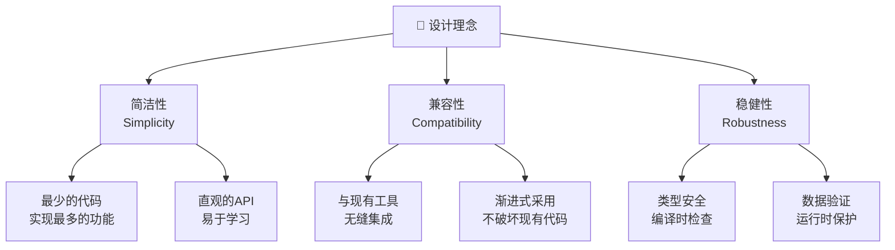
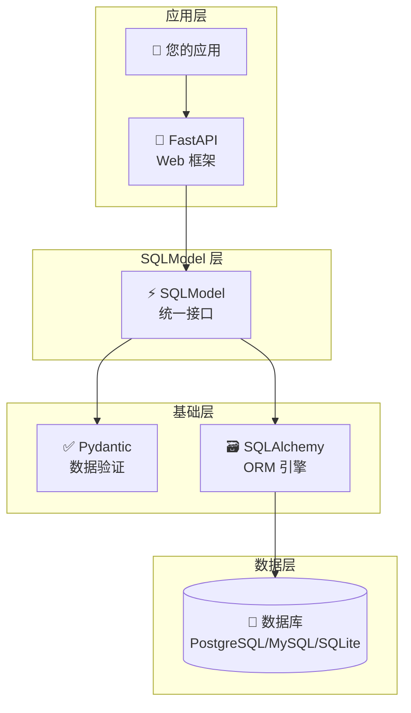
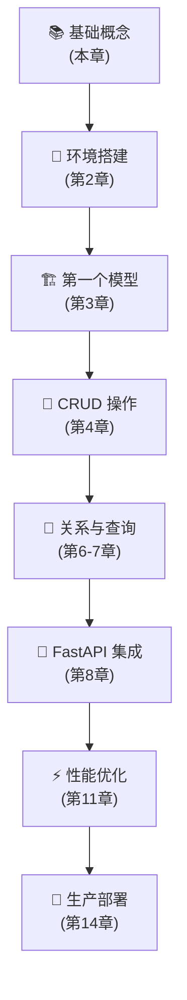

# SQLModel 介绍与核心概念

## 📖 章节概览

本章将为您全面介绍 SQLModel，包括其设计理念、核心概念、技术架构以及在现代 Python 开发中的价值。通过本章学习，您将建立对 SQLModel 的整体认知，为后续深入学习打下坚实基础。

## 🎯 学习目标

完成本章学习后，您将能够：
- ✅ 理解 SQLModel 的设计理念和核心价值
- ✅ 掌握 SQLModel 与其他技术的关系
- ✅ 了解 SQLModel 的技术架构和工作原理
- ✅ 识别 SQLModel 的适用场景和优势
- ✅ 建立 SQLModel 开发的思维模式

---

## 1. SQLModel 是什么？

### 1.1 定义与本质

**SQLModel** 是一个用于从 Python 代码与 SQL 数据库交互的现代化库，它基于 Python 类型注解，由 Pydantic 和 SQLAlchemy 提供支持。

```python
# SQLModel 的核心理念：一个类，多种用途
from typing import Optional
from sqlmodel import Field, SQLModel

class Hero(SQLModel, table=True):
    """这个类同时是：
    1. 数据库表的定义 (SQLAlchemy)
    2. API 响应的模型 (Pydantic)
    3. 数据验证的规则 (Pydantic)
    """
    id: Optional[int] = Field(default=None, primary_key=True)
    name: str = Field(max_length=50)
    secret_name: str
    age: Optional[int] = None
```

### 1.2 核心特性

| 特性 | 说明 | 价值 |
|------|------|------|
| **类型安全** | 基于 Python 类型注解 | 编译时错误检测，减少运行时错误 |
| **编辑器支持** | 完整的自动补全和错误提示 | 提高开发效率，减少调试时间 |
| **代码复用** | 一个模型类多种用途 | 减少代码重复，提高维护性 |
| **现代 Python** | 充分利用 Python 3.6+ 特性 | 代码更简洁、更易读 |
| **高度兼容** | 与 FastAPI、Pydantic、SQLAlchemy 无缝集成 | 易于集成到现有项目 |

### 1.3 设计理念



---

## 2. 技术生态与关系

### 2.1 技术栈关系图



### 2.2 与其他技术的关系

#### 2.2.1 SQLModel vs SQLAlchemy

```python
# 传统 SQLAlchemy 方式
from sqlalchemy import Column, Integer, String
from sqlalchemy.ext.declarative import declarative_base

Base = declarative_base()

class Hero(Base):
    __tablename__ = 'heroes'
    
    id = Column(Integer, primary_key=True)
    name = Column(String(50))
    secret_name = Column(String)
    age = Column(Integer)

# SQLModel 方式 - 更简洁，类型安全
from typing import Optional
from sqlmodel import Field, SQLModel

class Hero(SQLModel, table=True):
    id: Optional[int] = Field(default=None, primary_key=True)
    name: str = Field(max_length=50)
    secret_name: str
    age: Optional[int] = None
```

#### 2.2.2 SQLModel vs Pydantic

```python
# 纯 Pydantic 模型（仅用于数据验证）
from pydantic import BaseModel

class HeroBase(BaseModel):
    name: str
    secret_name: str
    age: Optional[int] = None

# SQLModel 模型（数据验证 + 数据库映射）
class Hero(SQLModel, table=True):
    id: Optional[int] = Field(default=None, primary_key=True)
    name: str
    secret_name: str
    age: Optional[int] = None
    
    # 自动具备 Pydantic 的所有验证功能
    # 同时可以作为数据库表使用
```

### 2.3 技术优势对比

| 方面 | 传统方式 | SQLModel 方式 |
|------|----------|---------------|
| **模型定义** | 需要分别定义 SQLAlchemy 模型和 Pydantic 模型 | 一个模型类解决所有需求 |
| **类型安全** | 有限的类型检查 | 完整的类型注解和检查 |
| **代码维护** | 多处修改，容易不一致 | 单点修改，自动同步 |
| **学习成本** | 需要学习多个库的 API | 统一的 API，学习成本低 |
| **开发效率** | 需要编写更多样板代码 | 代码简洁，开发效率高 |

---

## 3. 核心概念详解

### 3.1 模型 (Model)

**模型**是 SQLModel 的核心概念，它是一个 Python 类，同时定义了：
- 数据库表的结构
- 数据验证的规则
- API 序列化的格式

```python
from typing import Optional
from sqlmodel import Field, SQLModel
from datetime import datetime

class User(SQLModel, table=True):
    """用户模型 - 演示完整的模型定义"""
    
    # 主键字段
    id: Optional[int] = Field(
        default=None, 
        primary_key=True,
        description="用户唯一标识"
    )
    
    # 必填字段
    username: str = Field(
        max_length=50,
        min_length=3,
        regex=r"^[a-zA-Z0-9_]+$",
        description="用户名，3-50个字符，只能包含字母、数字和下划线"
    )
    
    email: str = Field(
        max_length=255,
        regex=r"^[\w\.-]+@[\w\.-]+\.\w+$",
        description="邮箱地址"
    )
    
    # 可选字段
    full_name: Optional[str] = Field(
        default=None,
        max_length=100,
        description="用户全名"
    )
    
    # 带默认值的字段
    is_active: bool = Field(
        default=True,
        description="用户是否激活"
    )
    
    created_at: datetime = Field(
        default_factory=datetime.utcnow,
        description="创建时间"
    )
```

### 3.2 字段 (Field)

**字段**定义了模型中每个属性的特性，包括数据类型、约束条件、默认值等。

```python
from sqlmodel import Field
from typing import Optional
from datetime import datetime
from enum import Enum

class UserRole(str, Enum):
    """用户角色枚举"""
    ADMIN = "admin"
    USER = "user"
    GUEST = "guest"

class Product(SQLModel, table=True):
    """产品模型 - 演示各种字段类型和约束"""
    
    # 自增主键
    id: Optional[int] = Field(default=None, primary_key=True)
    
    # 字符串字段（带长度限制）
    name: str = Field(max_length=100, min_length=1)
    
    # 文本字段（无长度限制）
    description: Optional[str] = Field(default=None)
    
    # 数值字段（带范围限制）
    price: float = Field(gt=0, le=999999.99, description="价格，必须大于0")
    
    # 整数字段
    stock: int = Field(ge=0, default=0, description="库存数量")
    
    # 布尔字段
    is_available: bool = Field(default=True)
    
    # 枚举字段
    category: str = Field(max_length=50)
    
    # 日期时间字段
    created_at: datetime = Field(default_factory=datetime.utcnow)
    updated_at: Optional[datetime] = Field(default=None)
    
    # 唯一约束
    sku: str = Field(unique=True, max_length=50, description="商品SKU")
    
    # 索引字段
    brand: str = Field(index=True, max_length=50)
```

### 3.3 表配置 (Table Configuration)

通过 `table=True` 参数和额外配置，可以精确控制数据库表的生成。

```python
from sqlmodel import SQLModel, Field
from typing import Optional

class Order(SQLModel, table=True):
    """订单模型 - 演示表配置"""
    
    # 表配置
    __tablename__ = "orders"  # 自定义表名
    __table_args__ = {
        "comment": "订单表",  # 表注释
        "mysql_engine": "InnoDB",  # MySQL 引擎
        "mysql_charset": "utf8mb4",  # 字符集
    }
    
    id: Optional[int] = Field(default=None, primary_key=True)
    order_number: str = Field(unique=True, max_length=32)
    customer_id: int = Field(foreign_key="customers.id")
    total_amount: float = Field(gt=0)
    status: str = Field(default="pending", max_length=20)
    
    # 复合索引示例
    # 注意：复合索引需要在类外定义或使用 __table_args__
```

### 3.4 关系 (Relationships)

**关系**定义了不同模型之间的关联，支持一对一、一对多、多对多等关系类型。

```python
from typing import List, Optional
from sqlmodel import SQLModel, Field, Relationship

class Team(SQLModel, table=True):
    """团队模型"""
    id: Optional[int] = Field(default=None, primary_key=True)
    name: str = Field(max_length=50)
    headquarters: str
    
    # 一对多关系：一个团队有多个英雄
    heroes: List["Hero"] = Relationship(back_populates="team")

class Hero(SQLModel, table=True):
    """英雄模型"""
    id: Optional[int] = Field(default=None, primary_key=True)
    name: str = Field(max_length=50)
    secret_name: str
    age: Optional[int] = None
    
    # 外键关系
    team_id: Optional[int] = Field(default=None, foreign_key="team.id")
    
    # 多对一关系：多个英雄属于一个团队
    team: Optional[Team] = Relationship(back_populates="heroes")
```

---

## 4. SQLModel 的工作原理

### 4.1 类型注解的魔法

```python
# SQLModel 如何理解类型注解
from typing import Optional
from sqlmodel import Field, SQLModel

class Example(SQLModel, table=True):
    # int -> SQL INTEGER
    id: int = Field(primary_key=True)
    
    # str -> SQL VARCHAR
    name: str = Field(max_length=50)  # VARCHAR(50)
    
    # Optional[int] -> SQL INTEGER NULL
    age: Optional[int] = None
    
    # float -> SQL FLOAT
    score: float
    
    # bool -> SQL BOOLEAN
    is_active: bool = True
```

### 4.2 元类机制

```python
# SQLModel 的元类机制（简化版）
class SQLModelMetaclass(type):
    """SQLModel 元类的工作原理"""
    
    def __new__(cls, name, bases, namespace, **kwargs):
        # 1. 检查是否是表模型
        is_table = kwargs.get('table', False)
        
        if is_table:
            # 2. 创建 SQLAlchemy 表定义
            cls._create_sqlalchemy_table(namespace)
            
            # 3. 创建 Pydantic 模型
            cls._create_pydantic_model(namespace)
            
            # 4. 合并两者的功能
            cls._merge_functionality(namespace)
        
        return super().__new__(cls, name, bases, namespace)
```

### 4.3 运行时行为

```python
# 创建模型实例时的行为
hero = Hero(name="Spider-Man", secret_name="Peter Parker", age=25)

# 1. Pydantic 验证
# - 检查字段类型
# - 验证约束条件
# - 应用默认值

# 2. SQLAlchemy 映射
# - 准备数据库操作
# - 设置关系属性
# - 配置会话管理

# 3. 序列化支持
# - JSON 序列化
# - 字典转换
# - API 响应格式化
```

---

## 5. 适用场景与优势

### 5.1 理想使用场景

#### 🚀 Web API 开发
```python
# FastAPI + SQLModel 的完美组合
from fastapi import FastAPI, Depends
from sqlmodel import Session

app = FastAPI()

@app.post("/heroes/", response_model=Hero)
def create_hero(hero: Hero, session: Session = Depends(get_session)):
    """同一个模型类用于：
    1. 请求体验证 (Pydantic)
    2. 数据库存储 (SQLAlchemy)
    3. 响应序列化 (Pydantic)
    """
    session.add(hero)
    session.commit()
    session.refresh(hero)
    return hero
```

#### 📊 数据分析项目
```python
# 类型安全的数据处理
from typing import List
from sqlmodel import select

def analyze_hero_ages(session: Session) -> List[Hero]:
    """编辑器完全支持的数据查询"""
    statement = select(Hero).where(Hero.age > 30)
    heroes = session.exec(statement).all()
    
    # 完整的类型提示和自动补全
    for hero in heroes:
        print(f"{hero.name} is {hero.age} years old")
    
    return heroes
```

#### 🏢 企业级应用
```python
# 复杂的业务模型
class Invoice(SQLModel, table=True):
    """发票模型 - 企业级特性"""
    id: Optional[int] = Field(default=None, primary_key=True)
    invoice_number: str = Field(unique=True, max_length=32)
    
    # 审计字段
    created_by: int = Field(foreign_key="users.id")
    created_at: datetime = Field(default_factory=datetime.utcnow)
    updated_at: Optional[datetime] = None
    
    # 业务字段
    customer_id: int = Field(foreign_key="customers.id")
    total_amount: Decimal = Field(max_digits=10, decimal_places=2)
    tax_amount: Decimal = Field(max_digits=10, decimal_places=2)
    
    # 状态管理
    status: InvoiceStatus = Field(default=InvoiceStatus.DRAFT)
    
    # 关系
    customer: "Customer" = Relationship()
    items: List["InvoiceItem"] = Relationship()
```

### 5.2 核心优势

#### ✅ 开发效率提升
- **减少 50% 的样板代码**：一个模型类替代多个定义
- **零配置的编辑器支持**：完整的自动补全和错误检查
- **统一的 API**：学会一套 API 即可处理所有场景

#### ✅ 代码质量保证
- **编译时类型检查**：MyPy 静态分析支持
- **运行时数据验证**：Pydantic 强大的验证机制
- **自动化测试友好**：类型安全的测试代码

#### ✅ 维护性增强
- **单一数据源**：模型定义即文档
- **自动同步**：数据库结构与 API 自动保持一致
- **重构安全**：类型系统保护重构过程

### 5.3 不适用场景

#### ❌ 极简项目
```python
# 如果只是简单的数据存储，可能过于复杂
# 简单的字典操作可能更合适
data = {"name": "John", "age": 30}
```

#### ❌ 非关系型数据库
```python
# SQLModel 专为 SQL 数据库设计
# NoSQL 数据库建议使用专门的 ODM
# 如 MongoDB 使用 Motor 或 Beanie
```

#### ❌ 高性能计算
```python
# 对于极高性能要求的场景
# 可能需要更底层的数据库访问方式
# 如直接使用 asyncpg 或 aiomysql
```

---

## 6. 学习路径建议

### 6.1 前置知识

#### 必备技能 (⭐⭐⭐)
- **Python 基础**：类、继承、类型注解
- **SQL 基础**：SELECT、INSERT、UPDATE、DELETE
- **面向对象编程**：封装、继承、多态

#### 推荐技能 (⭐⭐)
- **FastAPI 基础**：路由、依赖注入、响应模型
- **数据库设计**：范式、索引、关系设计
- **异步编程**：async/await、协程

#### 加分技能 (⭐)
- **SQLAlchemy 经验**：ORM 概念、查询构建
- **Pydantic 经验**：数据验证、序列化
- **Docker 容器化**：数据库环境搭建

### 6.2 学习顺序



### 6.3 实践建议

#### 🎯 边学边练
```python
# 每学完一个概念，立即编写代码验证
class Practice(SQLModel, table=True):
    """练习模型 - 验证学到的概念"""
    id: Optional[int] = Field(default=None, primary_key=True)
    concept: str = Field(description="学到的概念")
    code_example: str = Field(description="代码示例")
    understanding_level: int = Field(ge=1, le=10, description="理解程度 1-10")
```

#### 📝 记录学习笔记
```markdown
## 学习笔记模板

### 今日学习内容
- 概念：___
- 关键点：___
- 难点：___

### 代码实践
```python
# 今日练习代码
```

### 疑问和思考
- 问题：___
- 思考：___
- 待解决：___
```

#### 🔄 定期回顾
- **每周回顾**：总结本周学习内容
- **每月实践**：完成一个小项目
- **每季度评估**：评估学习进度和效果

---

## 7. 总结与下一步

### 7.1 本章要点回顾

✅ **SQLModel 本质**：基于类型注解的现代 Python ORM  
✅ **核心价值**：一个模型类，多种用途，减少代码重复  
✅ **技术架构**：Pydantic + SQLAlchemy 的完美结合  
✅ **适用场景**：Web API、数据分析、企业级应用  
✅ **学习路径**：从基础概念到生产实践的渐进式学习  

### 7.2 关键概念检查

请确保您理解以下概念后再继续：

- [ ] SQLModel 与 SQLAlchemy、Pydantic 的关系
- [ ] 模型类的双重身份（数据库表 + 数据验证）
- [ ] 类型注解在 SQLModel 中的作用
- [ ] Field 的基本用法和常见参数
- [ ] SQLModel 的适用场景和优势

### 7.3 下一步学习

🎯 **下一章预告**：[02-installation-and-setup.md](./02-installation-and-setup.md)  
在下一章中，我们将学习如何搭建 SQLModel 开发环境，包括：
- Python 环境配置
- SQLModel 安装
- 数据库选择和配置
- 开发工具推荐
- 第一个可运行的示例

### 7.4 实践作业

#### 作业 1：概念理解
创建一个简单的模型类，包含不同类型的字段：

```python
# 请完成这个模型定义
class Student(SQLModel, table=True):
    """学生模型 - 练习基础概念"""
    # TODO: 添加以下字段
    # - id: 主键，自增
    # - name: 姓名，必填，最大50字符
    # - email: 邮箱，可选
    # - age: 年龄，可选，范围 6-100
    # - is_active: 是否激活，默认 True
    # - created_at: 创建时间，自动设置
    pass
```

#### 作业 2：关系思考
思考以下场景的模型设计：
- 图书馆管理系统：图书、作者、借阅记录
- 电商系统：用户、商品、订单、购物车
- 博客系统：用户、文章、评论、标签

选择其中一个场景，画出实体关系图，思考需要哪些模型类和关系。

---

**📚 相关资源**
- [SQLModel 官方文档](https://sqlmodel.fastapi.org.cn/)
- [Pydantic 文档](https://pydantic-docs.helpmanual.io/)
- [SQLAlchemy 文档](https://docs.sqlalchemy.org/)
- [FastAPI 文档](https://fastapi.tiangolo.com/)

**🔗 导航**
- [⬅️ 上一章：系列概览](./00-series-overview.md)
- [➡️ 下一章：安装配置指南](./02-installation-and-setup.md)
- [🏠 返回目录](./README.md)

---

**最后更新**：2024年12月  
**版本**：v1.0  
**作者**：SQLModel 中文教程团队