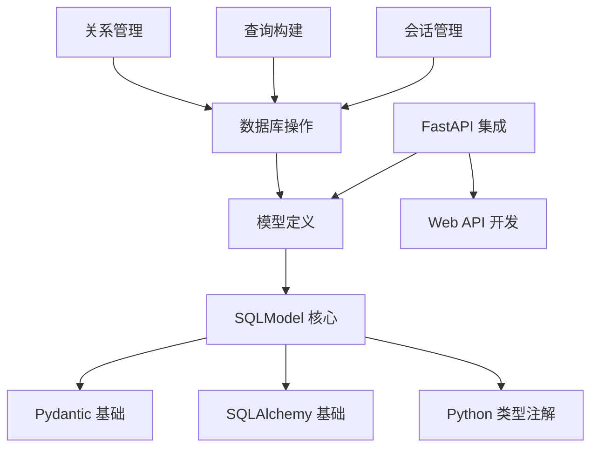

# SQLModel 官方网站深度内容分析与知识体系构建

## 概述

本文档对 SQLModel 官方网站 (https://sqlmodel.fastapi.org.cn/) 进行深度内容分析和知识体系构建，旨在为开发者提供清晰的学习路径和全面的知识地图。

## 1. 功能架构分析

### 1.1 核心功能模块识别

#### 🔧 核心技术模块
- **模型定义模块**：基于 Python 类型注解的数据模型定义
- **数据库操作模块**：CRUD 操作（创建、读取、更新、删除）
- **关系管理模块**：表间关系定义和操作
- **查询构建模块**：SQL 查询的 Python 化表达
- **会话管理模块**：数据库连接和事务管理

#### 🌐 集成功能模块
- **FastAPI 集成**：Web API 开发支持
- **Pydantic 集成**：数据验证和序列化
- **SQLAlchemy 集成**：底层 ORM 功能

### 1.2 功能间的依赖关系



### 1.3 技术栈和集成点

| 技术组件 | 作用 | 集成深度 |
|---------|------|----------|
| **Python 3.7+** | 基础运行环境 | 核心依赖 |
| **Pydantic** | 数据验证和序列化 | 深度集成 |
| **SQLAlchemy** | ORM 底层实现 | 深度集成 |
| **FastAPI** | Web 框架集成 | 可选集成 |
| **数据库驱动** | 数据库连接 | 适配器模式 |

## 2. 用户旅程映射

### 2.1 新手入门路径 (🟢 初级)

**学习目标**：掌握 SQLModel 基础概念和简单操作

**前置要求**：
- Python 基础语法 (必需)
- 基本的数据库概念 (推荐)

**学习路径**：
1. **环境准备** (难度: ⭐)
   - 虚拟环境创建
   - SQLModel 安装
   - 基础依赖配置

2. **核心概念理解** (难度: ⭐⭐)
   - 什么是 ORM
   - SQLModel 与传统 SQL 的关系
   - Python 类型注解回顾

3. **第一个模型** (难度: ⭐⭐)
   - 创建简单的表模型
   - 理解 `table=True` 参数
   - 字段类型和约束

4. **基础 CRUD 操作** (难度: ⭐⭐⭐)
   - 创建数据库引擎
   - 插入数据
   - 查询数据
   - 更新和删除

**预期时间**：1-2 周

### 2.2 进阶开发路径 (🟡 中级)

**学习目标**：掌握复杂查询、关系管理和 FastAPI 集成

**前置要求**：
- 完成新手入门路径
- 了解 SQL JOIN 概念
- FastAPI 基础知识 (可选)

**学习路径**：
1. **高级查询技术** (难度: ⭐⭐⭐)
   - WHERE 条件过滤
   - LIMIT 和 OFFSET 分页
   - 索引优化
   - 复杂查询构建

2. **关系管理** (难度: ⭐⭐⭐⭐)
   - 一对多关系
   - 多对多关系
   - 关系属性定义
   - 级联操作

3. **FastAPI 集成** (难度: ⭐⭐⭐)
   - 响应模型设计
   - 依赖注入
   - API 路径操作
   - 数据验证

4. **代码组织** (难度: ⭐⭐⭐)
   - 多文件项目结构
   - 模型继承
   - 配置管理

**预期时间**：2-4 周

### 2.3 专家级应用场景 (🔴 高级)

**学习目标**：掌握高级特性、性能优化和生产环境部署

**前置要求**：
- 完成进阶开发路径
- 深入理解数据库原理
- 生产环境经验

**学习路径**：
1. **高级数据类型** (难度: ⭐⭐⭐⭐)
   - UUID 字段
   - 十进制数处理
   - JSON 字段
   - 自定义类型

2. **性能优化** (难度: ⭐⭐⭐⭐⭐)
   - 查询优化策略
   - 连接池配置
   - 缓存机制
   - 批量操作

3. **测试策略** (难度: ⭐⭐⭐⭐)
   - 单元测试
   - 集成测试
   - 测试数据库
   - Mock 策略

4. **生产部署** (难度: ⭐⭐⭐⭐⭐)
   - 数据库迁移
   - 监控和日志
   - 安全配置
   - 容器化部署

**预期时间**：4-8 周

## 3. 内容分类体系

### 3.1 概念性知识 (What/Why)

#### 🎯 核心概念
- **SQLModel 是什么**
  - 定义和特点
  - 与其他 ORM 的区别
  - 设计理念

- **为什么选择 SQLModel**
  - 类型安全
  - 编辑器支持
  - FastAPI 集成
  - 代码复用

#### 🏗️ 架构概念
- **ORM 原理**
- **类型注解系统**
- **Pydantic 集成原理**
- **SQLAlchemy 集成原理**

### 3.2 操作性知识 (How)

#### 🛠️ 基础操作
- **环境搭建**
  - 安装配置
  - 虚拟环境
  - 依赖管理

- **模型定义**
  - 基础模型创建
  - 字段类型定义
  - 约束设置

- **数据库操作**
  - 连接配置
  - 表创建
  - CRUD 操作

#### 🔧 高级操作
- **关系管理**
  - 关系定义
  - 关系查询
  - 关系更新

- **查询优化**
  - 复杂查询
  - 性能调优
  - 索引使用

- **集成开发**
  - FastAPI 集成
  - 测试编写
  - 部署配置

### 3.3 参考性知识 (API/配置)

#### 📚 API 参考
- **核心类和方法**
  - SQLModel 类
  - Field 函数
  - Session 类
  - Engine 配置

- **查询 API**
  - select() 函数
  - where() 条件
  - join() 操作
  - 聚合函数

#### ⚙️ 配置参考
- **数据库配置**
  - 连接字符串
  - 连接池设置
  - 事务配置

- **模型配置**
  - 表配置
  - 字段配置
  - 关系配置

### 3.4 故障排除知识 (Troubleshooting)

#### 🐛 常见问题
- **安装问题**
  - 依赖冲突
  - 版本兼容性
  - 环境配置

- **运行时错误**
  - 连接错误
  - 查询错误
  - 类型错误

- **性能问题**
  - 慢查询诊断
  - 内存泄漏
  - 连接池问题

## 4. 学习资源整合

### 4.1 理论文档

#### 📖 官方文档
- **主页介绍** - 概念理解
- **特性说明** - 功能概览
- **教程指南** - 系统学习
- **API 参考** - 详细说明

#### 📚 扩展阅读
- **Pydantic 文档** - 数据验证基础
- **SQLAlchemy 文档** - ORM 深入理解
- **FastAPI 文档** - Web 开发集成
- **Python 类型注解** - 类型系统理解

### 4.2 实践示例

#### 💡 基础示例
- **Hero 模型示例** - 入门案例
- **CRUD 操作示例** - 基础操作
- **简单查询示例** - 查询入门

#### 🚀 进阶示例
- **关系模型示例** - 复杂关系
- **FastAPI 集成示例** - Web 开发
- **测试示例** - 质量保证

### 4.3 最佳实践

#### ✅ 代码规范
- **模型设计原则**
- **查询优化策略**
- **错误处理模式**
- **测试策略**

#### 🏆 架构模式
- **项目结构组织**
- **配置管理**
- **依赖注入**
- **分层架构**

### 4.4 社区资源

#### 🌐 官方资源
- **GitHub 仓库** - 源码和问题追踪
- **官方文档** - 权威指南
- **发布说明** - 版本更新

#### 👥 社区支持
- **GitHub Issues** - 问题求助
- **Stack Overflow** - 技术问答
- **Discord/Gitter** - 实时交流
- **博客文章** - 经验分享

## 5. 多层次知识地图

### 5.1 知识层次结构

```
🏛️ SQLModel 知识体系
├── 🎯 基础层 (Foundation)
│   ├── Python 基础
│   ├── 数据库概念
│   ├── 类型注解
│   └── ORM 概念
│
├── 🔧 核心层 (Core)
│   ├── 模型定义
│   ├── 基础 CRUD
│   ├── 查询构建
│   └── 会话管理
│
├── 🚀 应用层 (Application)
│   ├── 关系管理
│   ├── FastAPI 集成
│   ├── 高级查询
│   └── 性能优化
│
└── 🏆 专家层 (Expert)
    ├── 架构设计
    ├── 生产部署
    ├── 监控调试
    └── 扩展开发
```

### 5.2 知识点难度标注

| 知识点 | 难度等级 | 前置要求 | 学习时间 |
|--------|----------|----------|----------|
| **环境安装** | ⭐ | Python 基础 | 1-2 小时 |
| **基础模型** | ⭐⭐ | 类型注解 | 4-6 小时 |
| **CRUD 操作** | ⭐⭐⭐ | 基础模型 | 1-2 天 |
| **关系定义** | ⭐⭐⭐⭐ | CRUD 操作 | 3-5 天 |
| **FastAPI 集成** | ⭐⭐⭐ | FastAPI 基础 | 2-3 天 |
| **性能优化** | ⭐⭐⭐⭐⭐ | 生产经验 | 1-2 周 |
| **测试策略** | ⭐⭐⭐⭐ | 测试基础 | 3-5 天 |
| **生产部署** | ⭐⭐⭐⭐⭐ | DevOps 经验 | 1-2 周 |

## 6. 多种学习路径

### 6.1 快速上手路径 (⚡ 1-2 周)

**适用人群**：有 Python 和数据库基础，需要快速掌握 SQLModel

**学习计划**：
```
第1天：环境搭建 + 基础概念
第2-3天：模型定义 + 简单 CRUD
第4-5天：查询操作 + 数据过滤
第6-7天：FastAPI 集成基础
第8-10天：实战项目练习
第11-14天：进阶特性探索
```

**核心资源**：
- 官方快速开始指南
- Hero 示例代码
- FastAPI 集成示例

### 6.2 深度学习路径 (📚 2-3 个月)

**适用人群**：希望全面掌握 SQLModel，成为技术专家

**学习计划**：
```
第1-2周：基础概念 + 环境搭建
第3-4周：模型设计 + CRUD 操作
第5-6周：关系管理 + 高级查询
第7-8周：FastAPI 深度集成
第9-10周：测试 + 性能优化
第11-12周：生产部署 + 监控
```

**核心资源**：
- 完整官方教程
- SQLAlchemy 深度文档
- Pydantic 高级特性
- 实际项目案例

### 6.3 问题导向路径 (🎯 按需学习)

**适用人群**：有具体问题需要解决，按需学习

**常见问题场景**：

#### 场景1：Web API 开发
**学习路径**：
1. SQLModel 基础 → 2. 模型设计 → 3. FastAPI 集成 → 4. API 测试

#### 场景2：数据库迁移
**学习路径**：
1. 现有系统分析 → 2. 模型映射 → 3. 数据迁移 → 4. 测试验证

#### 场景3：性能优化
**学习路径**：
1. 性能分析 → 2. 查询优化 → 3. 索引设计 → 4. 监控部署

## 7. 文档空白点和改进机会

### 7.1 识别的文档空白点

#### 🔍 内容空白
1. **缺少完整的实战项目**
   - 当前主要是代码片段
   - 缺乏端到端的完整应用示例
   - 建议：添加博客系统、电商系统等完整案例

2. **性能优化指南不足**
   - 缺少详细的性能调优指南
   - 缺少基准测试和对比
   - 建议：添加性能最佳实践章节

3. **部署和运维指导缺失**
   - 缺少生产环境部署指南
   - 缺少监控和日志配置
   - 建议：添加 DevOps 相关章节

4. **错误处理和调试指南**
   - 缺少系统的错误处理策略
   - 缺少调试技巧和工具介绍
   - 建议：添加故障排除专门章节

#### 📚 结构空白
1. **学习路径指导**
   - 缺少明确的学习路径规划
   - 缺少难度分级和前置要求
   - 建议：添加学习路径导航

2. **API 参考文档**
   - API 文档不够详细
   - 缺少参数说明和示例
   - 建议：完善 API 参考手册

### 7.2 改进机会

#### 🚀 内容改进
1. **增加交互式示例**
   - 在线代码编辑器
   - 可运行的示例代码
   - 实时结果展示

2. **多媒体内容**
   - 视频教程
   - 图表和流程图
   - 架构图解

3. **社区贡献内容**
   - 用户案例研究
   - 最佳实践分享
   - 常见问题 FAQ

#### 🛠️ 结构改进
1. **导航优化**
   - 更清晰的目录结构
   - 搜索功能增强
   - 标签和分类系统

2. **个性化学习**
   - 根据用户背景推荐内容
   - 学习进度跟踪
   - 个性化学习路径

#### 🌐 技术改进
1. **文档网站功能**
   - 离线访问支持
   - 多语言版本
   - 移动端优化

2. **集成开发体验**
   - IDE 插件支持
   - 代码补全增强
   - 实时错误检查

### 7.3 优先级建议

#### 🔥 高优先级 (立即改进)
1. 添加完整的实战项目案例
2. 完善 API 参考文档
3. 增加故障排除指南
4. 优化学习路径导航

#### 🟡 中优先级 (短期改进)
1. 添加性能优化指南
2. 增加部署运维文档
3. 完善错误处理策略
4. 添加视频教程

#### 🟢 低优先级 (长期改进)
1. 开发交互式示例
2. 建设社区贡献平台
3. 实现个性化学习
4. 多语言版本支持

## 8. 总结与建议

### 8.1 SQLModel 知识体系特点

#### ✅ 优势
1. **设计理念先进**：类型安全、编辑器友好
2. **集成度高**：与 FastAPI、Pydantic 无缝集成
3. **学习曲线平缓**：基于熟悉的 Python 语法
4. **文档质量高**：结构清晰、示例丰富

#### ⚠️ 挑战
1. **生态相对年轻**：社区资源有限
2. **高级特性文档不足**：缺少深度指导
3. **实战案例缺乏**：理论多于实践

### 8.2 学习建议

#### 🎯 对于初学者
1. **扎实基础**：先掌握 Python 类型注解
2. **循序渐进**：按照官方教程顺序学习
3. **动手实践**：每个概念都要编写代码验证
4. **社区参与**：积极参与 GitHub 讨论

#### 🚀 对于进阶者
1. **深入源码**：理解底层实现原理
2. **性能优化**：关注生产环境性能
3. **最佳实践**：总结和分享经验
4. **贡献社区**：参与文档和代码贡献

### 8.3 发展趋势预测

#### 📈 技术发展
1. **类型系统增强**：更强的类型检查和推导
2. **性能优化**：查询优化和缓存机制
3. **工具链完善**：IDE 支持和开发工具
4. **生态扩展**：更多第三方集成

#### 🌍 社区发展
1. **用户增长**：随着 FastAPI 普及而增长
2. **企业采用**：更多企业级应用案例
3. **标准化**：成为 Python Web 开发标准选择
4. **国际化**：多语言文档和社区支持

---

**文档版本**：v1.0  
**最后更新**：2024年12月  
**作者**：技术文档专家  
**联系方式**：通过 GitHub Issues 反馈建议